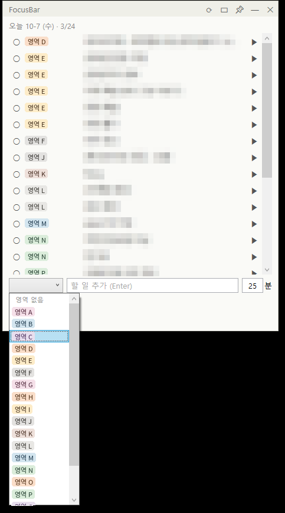
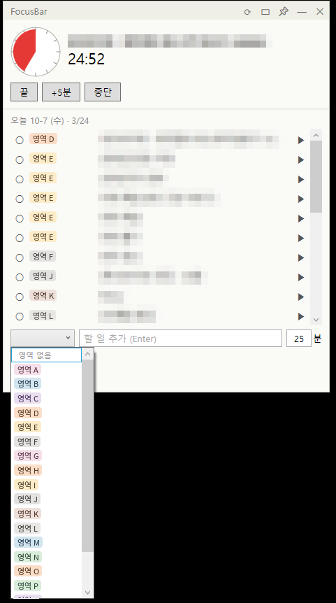

# notion-todo-timer

개인용으로 만든 Notion 할 일 + 타이머 창.




## 만든 이유

할 일 목록과 타이머가 따로 있어, 할 일마다 시간을 정해 집중하려면 두 도구를 오가야 하는 불편이 있음. 두 기능을 다른 창 위에 띄워둘 수 있는 작은 창 하나로 합침.

## 기능

### 목록
- **오늘**: '할 일' DB에서 `날짜 = 오늘`인 것. 끝낸 건 취소선으로 남고 헤더에 `완료/전체`
- **장기**: '할 일 (장기)' DB의 미완료 (접어둘 수 있음)
- **영역 배지**: 제목 앞에 `영역`을 색 배지로. 색은 Notion 옵션 색 그대로
- **정렬**: 기본은 영역별(Notion 옵션 순서), 같은 영역은 만든 순서, 완료는 맨 아래
- **드래그**: 오늘 목록은 줄을 끌어서 순서 변경. 그날 하루만 유지되고 다음 날은 다시 영역별

### 할 일 다루기
- **체크**: ○/● → Notion `완료` 체크박스에 반영. 체크해도 목록에서 안 사라지고 취소선
- **추가**: 영역 고르고 입력 후 Enter → '할 일' DB에 오늘 날짜 + 영역으로 들어감. 같은 영역 할 일 뒤에 붙음
- **우클릭**: 이름 수정(Enter 저장, Esc 취소) / 삭제(확인 후 Notion 휴지통)

### 타이머
- **▶**: 그 할 일로 카운트다운 (기본 25분). 60분 원판에 빨간 부채꼴로 남은 시간
- **끝났을 때**: 알림음 3번 + 창이 앞으로 옴 + [끝 / +5분 / 중단]. 끝 누르면 Notion에 완료

### 하루 준비 (하루 첫 새로고침 때 한 번)
- **이월**: 어제까지 못 끝낸 할 일을 오늘 날짜로 옮김 (루틴에서 생긴 건 제외)
- **루틴**: '루틴' DB에서 `사용` 체크 + 오늘 요일인 것을 할 일로 만듦. 오늘 이미 있으면 건너뜀

### 창
- **📌**: 다른 창 위 고정 켜고 끄기 (기본 켜짐)
- **크기**: 가장자리 드래그로 조절. 늘린 만큼 오늘 목록이 커짐
- **미니 모드**: 타이머만
- **날짜 기준**: 아침 7시 전은 전날. 켜둔 채 날 바뀌면 알아서 다시 불러옴

## 구조

```
FocusBar/
├─ Services/NotionClient.cs     Notion API 호출 (조회·추가·완료·이름 수정·삭제·이월·루틴 생성)
├─ Services/DayState.cs         하루 준비 실행 여부, 오늘 드래그 순서를 PC에 저장
├─ ViewModels/MainViewModel.cs  목록 상태, 정렬, 타이머 상태(Idle/Running/Finished)
├─ Models/TodoItem.cs           할 일 1건, 영역 선택지, Notion 색 매핑
├─ Controls/TimerDial.cs        타임타이머 원판 (OnRender로 그림)
├─ AppSettings.cs               설정 로드, DB 링크에서 ID 추출
└─ MainWindow.xaml              화면 (드래그·우클릭 처리는 .xaml.cs)
```

.NET 8 WPF, NuGet 패키지 없음. Notion API `2022-06-28`.

## 메모

- 웹 말고 WPF인 이유: 브라우저에선 CORS 때문에 Notion API 직접 호출이 안 됨. 위 고정도 `Topmost` 하나면 끝
- 오늘/장기 DB를 나눈 이유: 매일 생기는 할 일이랑 한 번 하고 끝나는 일을 섞으면 미완료가 계속 쌓임. 오늘 DB는 날짜로 필터해서 그날 것만 가져옴
- 남은 시간은 종료 시각에서 거꾸로 계산 (틱마다 1초씩 빼면 오차 쌓임)
- Notion은 한 번에 100건까지라 `next_cursor`로 끝까지 이어서 가져옴
- 하루 준비는 하루 한 번만: 오늘 생긴 루틴을 지웠는데 새로고침마다 다시 생기면 안 되니까. 실행한 날짜는 `%LOCALAPPDATA%\FocusBar\last-prepared.txt`
- 루틴은 이월 안 함: 어제 못 한 운동을 넘기면 오늘 생긴 운동이랑 두 개가 됨. 못 한 건 어제 날짜에 미완료로 남는 게 기록으로도 맞음
- 드래그 순서는 Notion이 아니라 PC에 저장 (`today-order.txt`): 하루 지나면 버리는 값이라 DB 속성을 늘릴 이유가 없음
- 하루 준비가 실패해도 목록은 보이게 따로 잡음

## 세팅

1. [Notion 통합](https://www.notion.so/profile/integrations)에서 연결 만들기 (액세스 토큰). 콘텐츠 읽기·업데이트·삽입, 사용자 정보 없음
2. DB 있는 상위 페이지 → `···` → 연결 → 추가 (DB마다 따로 붙였으면 나중에 만든 DB엔 다시 붙여야 함)
3. `appsettings.example.json` → `appsettings.json` 복사해서 채우기

   ```json
   {
     "NotionToken": "ntn_...",
     "TodayDatabaseId": "'할 일' DB 링크",
     "LongTermDatabaseId": "'할 일 (장기)' DB 링크",
     "RoutineDatabaseId": "'루틴' DB 링크",

     "TitleProperty": "할 일",
     "DueProperty": "마감",
     "DoneProperty": "완료",
     "DonePropertyType": "checkbox",
     "DateProperty": "날짜",
     "CategoryProperty": "영역",
     "RoutineRelationProperty": "루틴",

     "RoutineNameProperty": "이름",
     "RoutineDaysProperty": "요일",
     "RoutineEnabledProperty": "사용",
     "CarryOver": true,
     "DayStartHour": 7,

     "DefaultMinutes": 25,
     "ExtendMinutes": 5,
     "DialScaleMinutes": 60
   }
   ```

   DB 링크는 통째로 붙여도 ID만 뽑아 씀. `LongTermDatabaseId`, `RoutineDatabaseId`는 비우면 그 기능만 꺼짐

4. Visual Studio에서 `FocusBar.csproj` 열고 실행

`appsettings.json`은 토큰 들어가서 `.gitignore`에 있음.

### 필요한 Notion 속성

- 할 일 (오늘): `할 일`(제목), `완료`(체크박스), `날짜`(날짜), `영역`(선택), `루틴`(관계형 → 루틴 DB), `마감`(날짜, 선택)
- 할 일 (장기): `할 일`(제목), `완료`(체크박스), `마감`(날짜, 선택), `영역`(선택, 선택)
- 루틴: `이름`(제목), `영역`(선택), `요일`(다중 선택: 월~일), `사용`(체크박스)

영역 옵션은 DB끼리 공유 안 됨. 할 일에 영역을 새로 만들면 루틴 DB에도 같은 이름으로 추가.
